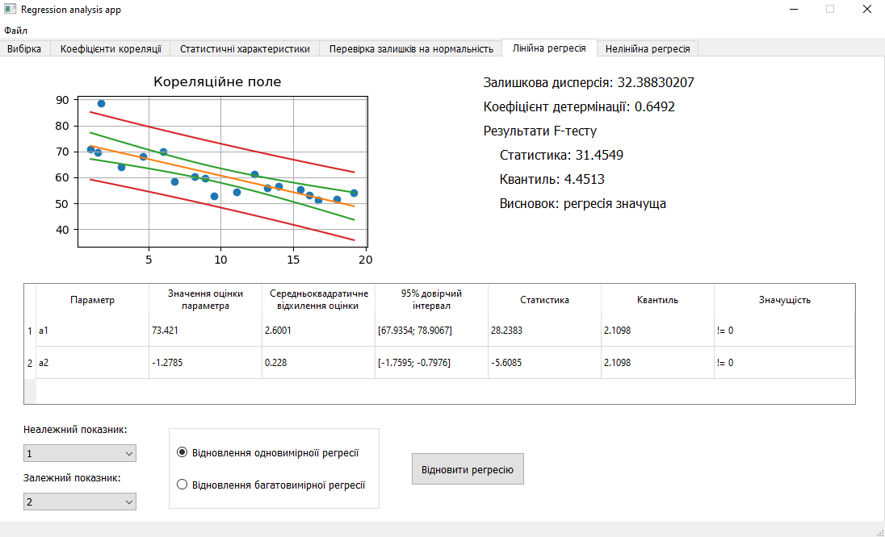
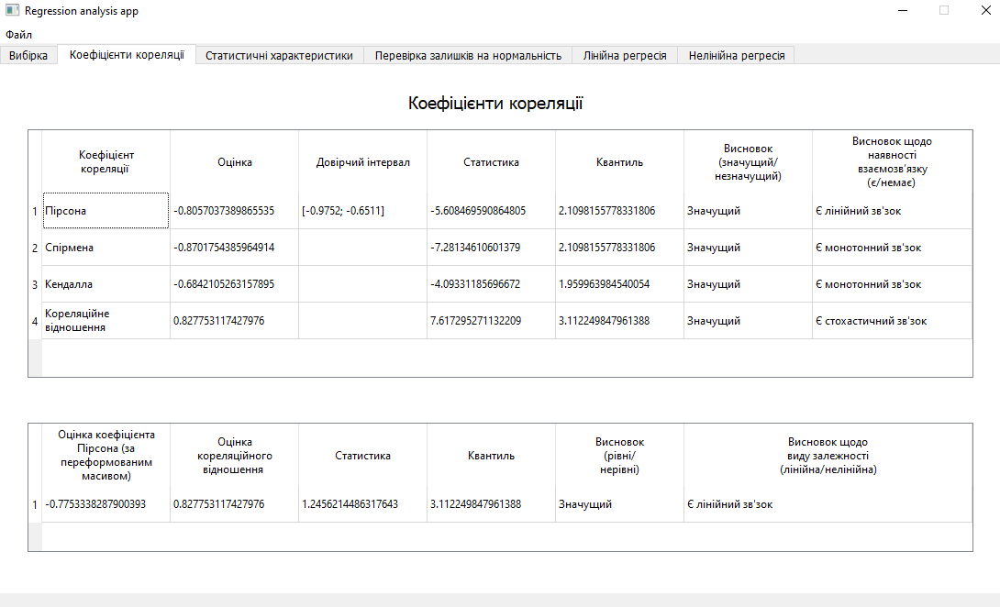
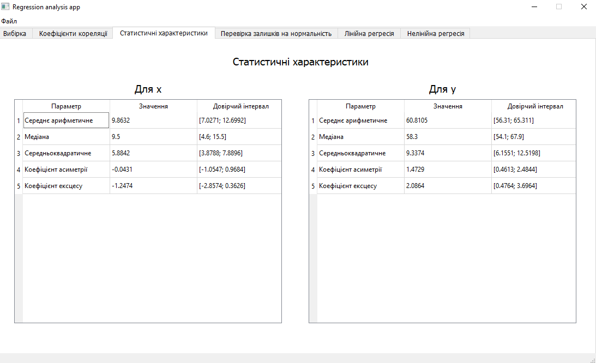
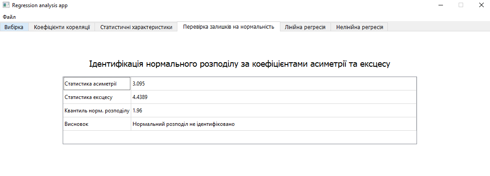
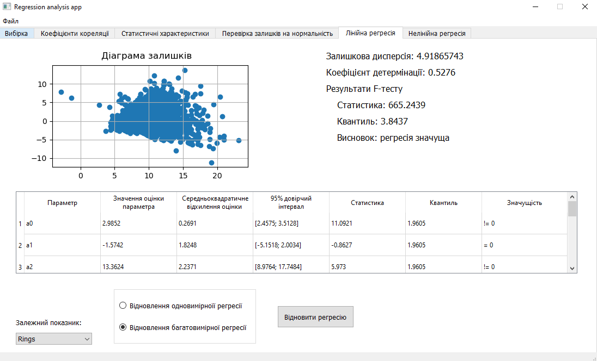
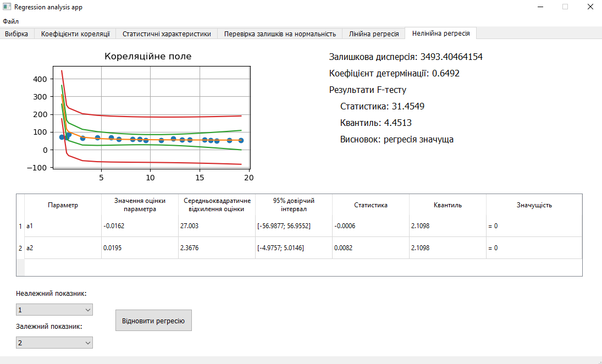

# regression-analysis-app

This is a regression analysis application that allows you to build linear regression models on univariate and multivariate data, as well as nonlinear regression y(x) = x / (a + bx).

An example of univariate regression recovery is shown in the following figure. To do this, load the univariate data, select the dependent and independent features and restore the regression, after which the necessary statistical characteristics will be calculated, the regression model will be built and the correlation field will be plotted.

The correlation coefficients are displayed in the following figure.

The statistical characteristics are displayed in the following figure.

The identification of the normal distribution behind the skewness and kurtosis coefficients are displayed in the following figure.

An example of linear regression reconstruction for multivariate data is shown in the following figure. To do this, select the dependent variable and all other variables will be independent. After that, a linear multivariate regression model will be built and the residuals will be plotted.

An example of nonlinear regression recovery y(x) = x / (a + bx) is shown in the following figure. 

